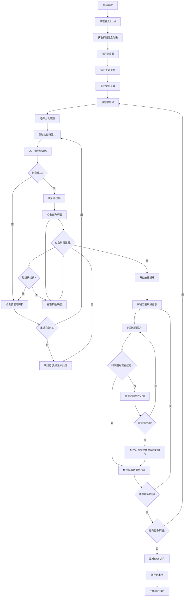

# 航班数据爬虫系统 - 产品需求文档

## 1. Product Overview

本系统是一个自动化航班数据采集工具，专门从133.cn航班查询网站批量获取航班动态信息并导出为Excel格式。
- 解决手动查询航班信息效率低下的问题，为需要批量处理航班数据的用户提供自动化解决方案。
- 目标用户包括航空公司、旅行社、数据分析师等需要大量航班数据的专业用户。

## 2. Core Features

### 2.1 Feature Module

我们的航班数据爬虫系统包含以下主要功能模块：
1. **数据输入模块**：Excel文件读取，航班号和日期信息导入
2. **网页自动化模块**：浏览器控制，表单填写，智能验证码处理（支持重试机制）
3. **数据提取模块**：航班信息解析，图片文字识别，数据结构化
4. **数据输出模块**：Excel文件生成，数据格式化导出，异常记录标注
5. **系统配置模块**：参数设置，日志记录，错误处理，重试策略管理

### 2.2 Page Details

| 模块名称 | 功能名称 | 功能描述 |
|----------|----------|----------|
| 数据输入模块 | Excel读取 | 读取包含航班号和出发日期的Excel文件，支持批量数据导入 |
| 网页自动化模块 | 浏览器启动 | 启动Chrome浏览器，访问133.cn航班查询页面 |
| 网页自动化模块 | 表单操作 | 点击"按航班号"按钮，填写航班号和出发日期信息 |
| 网页自动化模块 | 验证码处理 | 获取验证码图片，使用OCR识别4位字母验证码并自动填入，支持识别失败重试和验证码错误重试，最大重试6次 |
| 网页自动化模块 | 查询执行 | 点击查询按钮，等待页面加载完成 |
| 数据提取模块 | 航段识别 | 识别查询结果中的所有航段数据条目，一个航班可能包含多个航段 |
| 数据提取模块 | 航段循环处理 | 循环遍历每个航段，逐个提取完整的航段信息 |
| 数据提取模块 | 文本提取 | 提取出发机场、到达机场、计划起飞/到达时间、航班状态等文本信息 |
| 数据提取模块 | 图片识别 | 识别实际起飞和到达时间的图片，转换为HH:MM格式时间，支持识别失败重试机制，最大重试3次，识别失败时保存原始图片到Excel |
| 数据输出模块 | 数据整理 | 将提取的数据按航班号、日期、航段进行结构化整理，每个航段占用一行记录 |
| 数据输出模块 | Excel导出 | 生成包含所有航班信息的Excel文件，保存到本地，多航段数据分行显示 |
| 系统配置模块 | 参数配置 | 设置浏览器参数、等待时间、验证码重试次数（最大6次）、时间图片识别重试次数（最大3次）等系统参数 |
| 系统配置模块 | 日志记录 | 记录系统运行日志，包括成功、失败、验证码重试、时间图片识别重试、跳过记录等详细信息 |
| 网页自动化模块 | 验证码重试 | 识别失败或验证码错误时自动点击验证码图片刷新，支持最大6次重试 |
| 数据输出模块 | 异常标注 | 对验证码重试超限的航班在Excel中标注为"未处理"状态 |

## 3. Core Process

**主要用户操作流程：**

1. 用户准备包含航班号和出发日期的Excel输入文件
2. 启动航班数据爬虫系统
3. 系统自动读取Excel文件中的航班信息
4. 对每个航班号和日期组合执行以下操作：
   - 打开浏览器访问133.cn航班查询页面
   - 点击"按航班号"查询方式
   - 填入航班号和出发日期
   - 获取并识别验证码图片（支持重试机制）
   - 提交查询请求并检查验证码错误响应
   - 解析查询结果中的所有航段数据
   - 提取各项航班信息字段
5. 将所有提取的数据整合并导出为Excel文件
6. 系统完成处理并生成运行报告



## 4. User Interface Design

### 4.1 Design Style

由于这是一个命令行/后台运行的数据爬虫工具，主要的用户界面体现在：
- **控制台输出**：使用清晰的文本格式显示运行状态和进度
- **日志文件**：结构化的日志记录，便于问题排查
- **配置文件**：JSON或YAML格式的参数配置文件
- **输出Excel**：标准的表格格式，包含清晰的列标题和数据分类

### 4.2 Page Design Overview

| 界面名称 | 模块名称 | UI元素 |
|----------|----------|--------|
| 控制台界面 | 进度显示 | 文本进度条、当前处理航班号、成功/失败计数 |
| 控制台界面 | 状态信息 | 实时显示当前操作步骤、错误提示、完成时间预估 |
| 配置文件 | 参数设置 | JSON格式配置文件，包含浏览器设置、等待时间、重试参数 |
| 输出Excel | 数据表格 | 标准表格格式，列标题包括航班号、日期、出发机场、到达机场等 |
| 日志文件 | 运行记录 | 时间戳、日志级别、操作描述、错误详情的结构化记录 |

### 4.3 Responsiveness

本系统为桌面端命令行工具，主要在Windows环境下运行，不涉及响应式设计需求。重点关注系统稳定性和数据处理效率。

## 5. 多航段数据处理机制

### 5.1 航段数据结构
- **一对多关系**：一个航班查询可能返回多条航段数据（如中转航班）
- **航段识别**：系统需要自动识别查询结果中的所有航段条目
- **循环处理**：对每个航段逐个提取完整的信息字段
- **数据完整性**：确保每个航段的所有字段都被正确提取

### 5.2 航段处理流程
- **航段计数**：首先统计查询结果中的航段总数
- **循环遍历**：按顺序处理每个航段，从第一个到最后一个
- **字段提取**：为每个航段提取出发机场、到达机场、计划起飞、计划到达、实际起飞、实际到达、航班状态
- **数据验证**：验证每个航段的数据完整性和格式正确性
- **记录保存**：每个航段作为独立记录保存到内存中

### 5.3 Excel输出格式
- **分行显示**：每个航段在Excel中占用一行记录
- **航班标识**：所有航段共享相同的航班号和查询日期
- **航段序号**：为每个航段添加序号标识（如1、2、3...）
- **数据关联**：通过航班号和日期将多个航段关联为同一次航班查询
- **图片字段处理**：当时间图片识别失败时，实际起飞和实际到达字段将包含原始图片数据（base64编码或图片文件链接）
- **混合数据格式**：同一列可能包含识别成功的时间文本（如"08:31"）和识别失败的图片数据

## 6. 图片识别处理机制

### 6.1 时间图片识别流程
- **初始识别**：使用OCR技术识别实际起飞和到达时间图片，转换为HH:MM格式
- **识别失败处理**：如果OCR无法识别或识别结果格式错误，自动重试识别
- **重试限制**：每个时间图片最多重试3次
- **失败处理**：超过重试次数的时间图片在Excel中标注为"识别失败"，同时将原始图片保存到对应字段
- **图片保存**：识别失败的时间图片以base64编码或本地文件形式保存到Excel的实际起飞/到达字段中
- **格式验证**：识别结果必须符合HH:MM格式（24小时制），如08:31

### 6.2 时间图片重试策略
- **重试计数器**：为每个时间图片维护独立的重试计数器
- **重试间隔**：每次重试之间设置适当的等待时间（建议0.5-1秒）
- **日志记录**：详细记录每次时间图片识别和重试的过程
- **状态跟踪**：实时显示当前时间图片的识别状态和重试次数

### 6.3 图片保存机制
- **保存条件**：当时间图片识别失败超过最大重试次数时触发图片保存
- **保存格式**：支持base64编码直接嵌入Excel或保存为本地文件并插入图片链接
- **字段映射**：实际起飞时间图片保存到"实际起飞"字段，实际到达时间图片保存到"实际到达"字段
- **用户体验**：用户可以在Excel中直接查看原始图片进行人工识别
- **文件管理**：如采用本地文件保存方式，图片文件统一保存到指定目录并按航班号+日期+字段名命名

## 7. 验证码处理机制

### 7.1 验证码识别流程
- **初始识别**：使用OCR技术识别4位字母验证码
- **识别失败处理**：如果OCR无法识别或识别结果为空，自动点击验证码图片刷新
- **验证码错误处理**：提交查询后如果返回验证码错误（status:1008），自动刷新验证码重新识别
- **重试限制**：每个航班的验证码处理最多重试6次
- **失败处理**：超过重试次数的航班跳过处理，在输出Excel中标注为"未处理"

### 7.2 错误响应处理
系统需要识别以下验证码相关的错误响应：
```json
{"status":1008,"msg":"验证码错误","data":null}
```

### 7.3 重试策略
- **重试计数器**：为每个航班维护独立的重试计数器
- **重试间隔**：每次重试之间设置适当的等待时间（建议1-2秒）
- **日志记录**：详细记录每次验证码识别和重试的过程
- **状态跟踪**：实时显示当前航班的验证码处理状态和重试次数