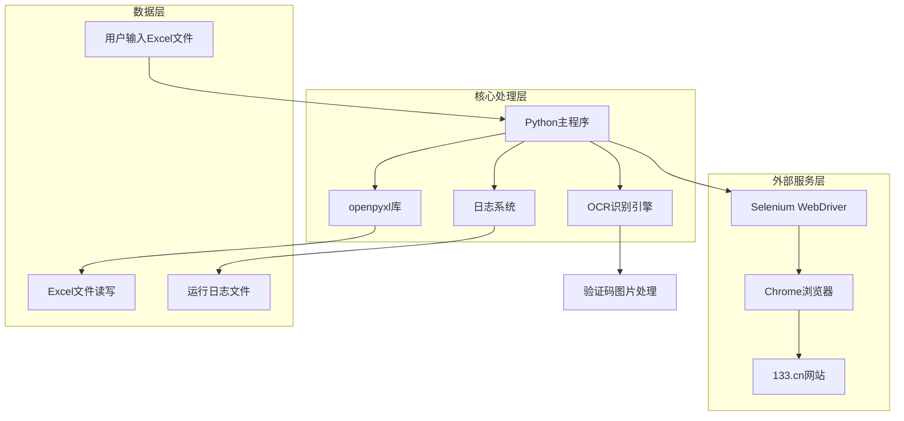
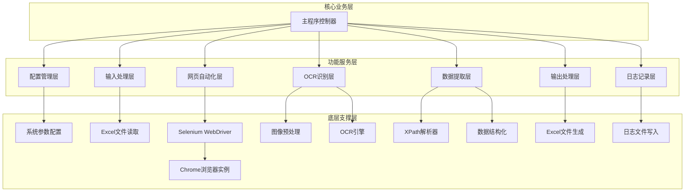
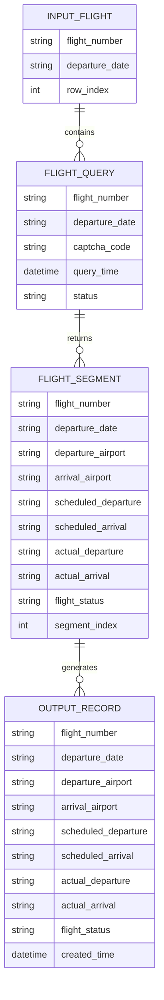

# 航班数据爬虫系统 - 技术架构文档

## 1. Architecture Design



## 2. Technology Description

* **主要语言**: Python 3.8+

* **网页自动化**: Selenium WebDriver + ChromeDriver

* **OCR识别**: Tesseract-OCR + pytesseract 或 PaddleOCR

* **Excel处理**: openpyxl

* **图像处理**: Pillow (PIL)

* **HTTP请求**: requests (备用方案)

* **日志记录**: logging (Python内置) + TimedRotatingFileHandler

* **配置管理**: configparser 或 json

## 3. Route Definitions

本系统为命令行工具，不涉及Web路由，主要的程序流程路径如下：

| 流程路径             | 目的                       |
| ---------------- | ------------------------ |
| /main            | 主程序入口，初始化系统配置和日志         |
| /input\_handler  | 输入文件处理模块，读取Excel中的航班信息   |
| /web\_automation | 网页自动化模块，控制浏览器操作          |
| /ocr\_processor  | OCR识别模块，处理验证码和时间图片       |
| /data\_extractor | 数据提取模块，解析网页内容            |
| /output\_handler | 输出处理模块，生成Excel结果文件       |
| /config\_manager | 配置管理模块，处理系统参数            |
| /logger          | 日志管理模块，记录运行状态，支持按天分割日志文件 |

## 4. API Definitions

### 4.1 核心模块接口

**Excel输入处理**

```python
def read_flight_data(file_path: str) -> List[Dict[str, str]]:
    """
    读取输入Excel文件中的航班信息
    
    Args:
        file_path: Excel文件路径
    
    Returns:
        航班信息列表，每个元素包含flight_number和departure_date
    """
```

**网页自动化操作**

```python
def query_flight_info(flight_number: str, departure_date: str) -> Dict[str, Any]:
    """
    查询单个航班的详细信息
    
    Args:
        flight_number: 航班号，如"MU5100"
        departure_date: 出发日期，格式"YYYY-MM-DD"
    
    Returns:
        包含航班详细信息的字典
    """
```

**OCR识别接口**

```python
def recognize_captcha(image_element) -> str:
    """
    识别验证码图片
    
    Args:
        image_element: Selenium获取的图片元素
    
    Returns:
        识别出的4位字母验证码
    """

def recognize_time_image(image_element) -> str:
    """
    识别时间图片
    
    Args:
        image_element: Selenium获取的时间图片元素
    
    Returns:
        HH:MM格式的时间字符串
    """
```

**数据提取接口**

```python
def extract_flight_segments(driver) -> List[Dict[str, str]]:
    """
    提取页面中的所有航段数据
    
    Args:
        driver: Selenium WebDriver实例
    
    Returns:
        航段信息列表，每个元素包含出发机场、到达机场等字段
    """
```

**Excel输出接口**

```python
def save_to_excel(flight_data: List[Dict[str, Any]], output_path: str) -> bool:
    """
    将航班数据保存为Excel文件
    
    Args:
        flight_data: 航班数据列表
        output_path: 输出文件路径
    
    Returns:
        保存是否成功
    """
```

**日志记录接口**

```python
def setup_logger(log_level: str = "INFO", log_dir: str = "logs") -> logging.Logger:
    """
    初始化日志系统，配置按天分割的日志文件
    
    Args:
        log_level: 日志级别，如"DEBUG", "INFO", "WARNING", "ERROR"
        log_dir: 日志文件目录
    
    Returns:
        配置好的Logger实例
    """

def log_flight_process(flight_number: str, operation: str, status: str, details: str = "") -> None:
    """
    记录航班处理过程日志
    
    Args:
        flight_number: 航班号
        operation: 操作类型，如"验证码识别", "数据提取", "Excel保存"
        status: 操作状态，如"开始", "成功", "失败", "重试"
        details: 详细信息或错误描述
    """

def log_exception(module_name: str, function_name: str, exception: Exception, context: Dict[str, Any] = None) -> None:
    """
    记录异常信息，包含详细的上下文信息
    
    Args:
        module_name: 发生异常的模块名称
        function_name: 发生异常的函数名称
        exception: 异常对象
        context: 异常发生时的上下文信息
    """

def log_system_status(total_flights: int, processed: int, success: int, failed: int) -> None:
    """
    记录系统运行状态统计信息
    
    Args:
        total_flights: 总航班数
        processed: 已处理数量
        success: 成功数量
        failed: 失败数量
    """
```

## 5. 日志系统设计

### 5.1 日志文件管理

* **按天分割**：使用TimedRotatingFileHandler实现每天生成一个独立的日志文件

* **文件命名规则**：flight\_crawler\_YYYY-MM-DD.log（如flight\_crawler\_2025-01-15.log）

* **文件大小限制**：单个日志文件最大10MB，超过后自动轮转

* **保留策略**：默认保留30天的日志文件，自动清理过期文件

* **存储位置**：统一存储在项目根目录下的logs文件夹中

### 5.2 日志格式规范

```
时间戳 - Logger名称 - 日志级别 - [模块名.函数名:行号] - 日志消息
示例：2025-01-15 10:30:25 - FlightCrawler - INFO - [web_automation.query_flight_info:45] - 开始查询航班 MU5100
```

### 5.3 日志级别定义

* **DEBUG**：详细的调试信息，包括变量值、函数调用等

* **INFO**：一般信息，记录程序正常运行的关键步骤

* **WARNING**：警告信息，程序可以继续运行但需要注意的问题

* **ERROR**：错误信息，程序遇到错误但可以继续处理其他任务

* **CRITICAL**：严重错误，程序无法继续运行

### 5.4 异常日志记录规范

异常日志必须包含以下信息：

* **异常发生的模块和函数**：精确定位问题位置

* **异常类型和错误消息**：了解具体错误原因

* **上下文信息**：包括当前处理的航班号、操作步骤、相关参数等

* **堆栈跟踪**：完整的异常堆栈信息

* **重试信息**：如果是重试场景，记录重试次数和重试原因

### 5.5 关键操作日志记录

系统需要记录以下关键操作的日志：

* **系统启动和关闭**：记录系统启动时间、配置信息、关闭原因

* **文件读取**：输入Excel文件路径、读取的航班数量

* **浏览器操作**：浏览器启动、页面访问、元素定位

* **验证码处理**：验证码获取、识别结果、重试次数

* **数据提取**：航段数量、提取成功/失败的字段

* **图片识别**：OCR识别结果、重试过程、保存图片路径

* **Excel输出**：输出文件路径、保存的记录数量

* **错误处理**：所有异常和错误的详细信息

## 6. Server Architecture Diagram



## 7. Data Model

### 7.1 Data Model Definition



### 7.2 Data Definition Language

**输入数据结构 (Excel格式)**

```python
# 输入Excel文件结构
INPUT_COLUMNS = {
    'A': 'flight_number',    # 航班号，如"MU5100"
    'B': 'departure_date'    # 出发日期，如"2025-09-17"
}

# 示例数据
INPUT_DATA = [
    {'flight_number': 'MU5100', 'departure_date': '2025-09-17'},
    {'flight_number': 'CA1234', 'departure_date': '2025-09-18'},
    {'flight_number': 'CZ3456', 'departure_date': '2025-09-19'}
]
```

**输出数据结构 (Excel格式)**

```python
# 输出Excel文件结构
OUTPUT_COLUMNS = {
    'A': '航班号',
    'B': '出发日期', 
    'C': '出发机场',
    'D': '到达机场',
    'E': '计划起飞',
    'F': '计划到达',
    'G': '实际起飞',
    'H': '实际到达',
    'I': '航班状态',
    'J': '查询时间'
}

# 示例输出数据
OUTPUT_DATA = [
    {
        '航班号': 'MU5100',
        '出发日期': '2025-09-17',
        '出发机场': '上海浦东',
        '到达机场': '北京首都',
        '计划起飞': '08:30',
        '计划到达': '11:20',
        '实际起飞': '08:31',
        '实际到达': '11:25',
        '航班状态': '已到达',
        '查询时间': '2025-01-15 10:30:00'
    }
]
```

**系统配置数据结构**

```python
# config.json 配置文件结构
CONFIG_STRUCTURE = {
    "browser": {
        "headless": False,
        "window_size": "1920,1080",
        "user_agent": "Mozilla/5.0 (Windows NT 10.0; Win64; x64) AppleWebKit/537.36",
        "timeout": 30
    },
    "ocr": {
        "engine": "tesseract",  # tesseract 或 paddleocr
        "language": "eng",
        "config": "--psm 8 -c tessedit_char_whitelist=ABCDEFGHIJKLMNOPQRSTUVWXYZ"
    },
    "retry": {
        "max_attempts": 3,
        "delay_seconds": 2
    },
    "output": {
        "file_prefix": "flight_data_",
        "timestamp_format": "%Y%m%d_%H%M%S"
    },
    "logging": {
        "level": "INFO",
        "log_dir": "logs",
        "file_prefix": "flight_crawler_",
        "max_file_size": "10MB",
        "backup_count": 30,
        "format": "%(asctime)s - %(name)s - %(levelname)s - [%(module)s.%(funcName)s:%(lineno)d] - %(message)s",
        "date_format": "%Y-%m-%d %H:%M:%S",
        "console_output": true,
        "file_rotation": "daily"
    }
}
```

